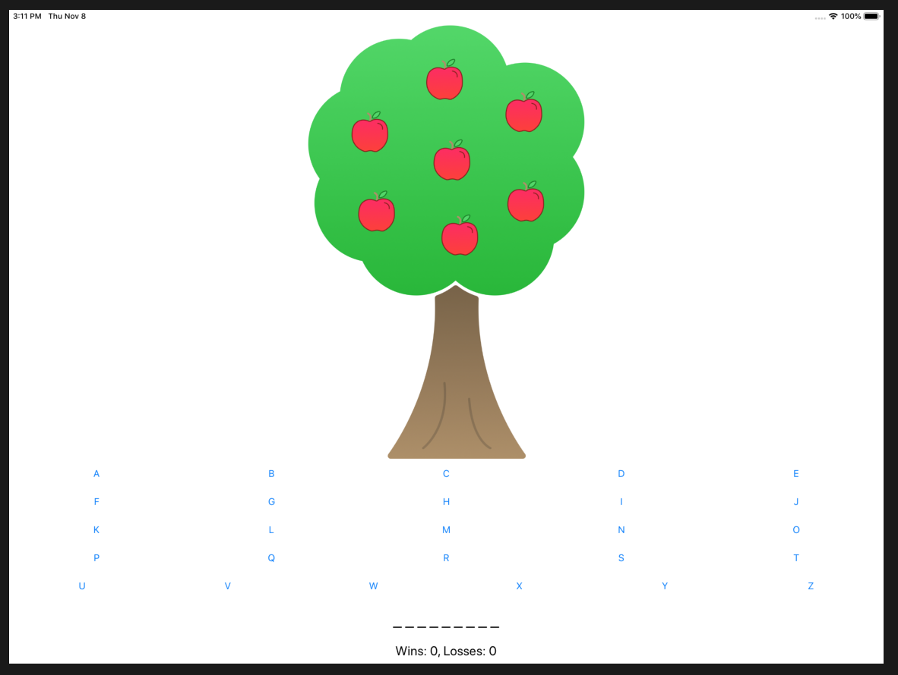
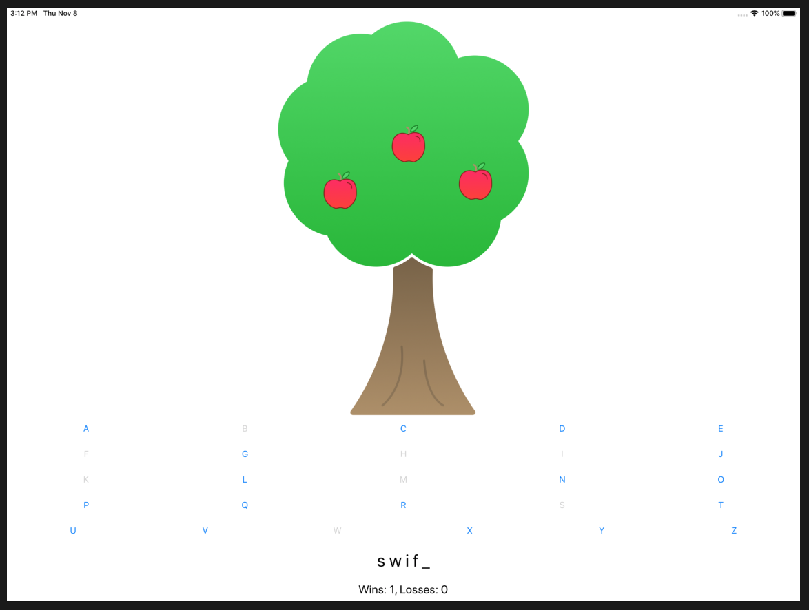

# Apple Pie

* This project is an iPad game called Apple Pie.
* It's a simple word-guessing game in which the player has a limited number of turns to guess the letters in a word.
* Each incorrect guess results in an apple falling of the tree.
* The player wins by guessing the word correclty before all the apples are gone.

###### This is the first view

###### This is when the word 'swift' is almost complete, while a few mistakes have already been made

